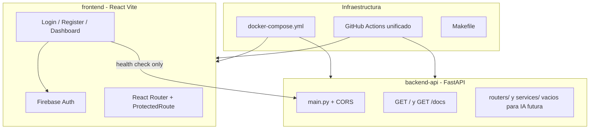

# Plan: Scaffold Monetra (sin IA)

## Contexto

| Aspecto | [Interspeaker](https://github.com/JuanPabloAnteSuarez03/Interspeaker) | Monetra (objetivo) |
|---------|------------|-------------------|
| Backend | Flask + Gunicorn | **FastAPI + Uvicorn** |
| Carpetas | `Backend/`, `Frontend/` | **`backend-api/`, `frontend/`** (ya en CI y README) |
| Frontend | React 19 + Vite + Firebase | React 18 + Vite + **Tailwind v4** + Firebase |
| Tests FE | Jest | **Vitest** (ya configurado en [`.github/workflows/frontend-ci.yml`](.github/workflows/frontend-ci.yml)) |
| Tests BE | pytest + pytest-flask | **pytest + httpx TestClient** |
| IA | Gemini + Deepgram + Firestore | **Excluido** — solo placeholders |
| Puertos | 5100 / 3100 | **8000** (API) / **5173** (dev) / **3100** (Docker prod) |

Estado actual del repo: solo [`README.md`](README.md), [`.gitignore`](.gitignore) y 2 workflows CI stub sin código. El README afirma features no commiteadas — se actualizará para reflejar la realidad.

---

## Arquitectura objetivo



---

## Fase 1 — Backend FastAPI (`backend-api/`)

### Estructura

```text
backend-api/
├── main.py                 # FastAPI app factory, CORS, lifespan
├── requirements.txt
├── .env.example
├── Dockerfile
├── pytest.ini
├── routers/
│   └── __init__.py         # sin routers de IA aún
├── services/
│   └── __init__.py         # placeholder para gemini_service / ocr_service futuros
└── tests/
    ├── conftest.py         # TestClient con httpx
    └── test_smoke.py       # health + OpenAPI schema
```

### `main.py` — patrones clave (adaptados de Interspeaker `app.py`)

- `FastAPI(title="Monetra API", version="0.1.0")`
- CORS: `allow_origins` desde env (`CORS_ORIGINS=http://localhost:5173,http://localhost:3100`)
- `GET /` → `{"message": "Monetra backend funcionando"}`
- `GET /api/openapi.json` → spec mínima (o usar `/openapi.json` nativo de FastAPI en `/docs`)
- Sin blueprints de interview/stt/tts/llm

### `requirements.txt` (sin dependencias de IA)

```
fastapi>=0.115.0
uvicorn[standard]>=0.32.0
python-dotenv>=1.0.1
pytest>=8.0.0
pytest-cov>=4.1.0
httpx>=0.27.0
```

> `firebase-admin`, `google-genai`, `deepgram-sdk` se agregan en fase IA posterior.

### `Dockerfile` (prod)

- Base `python:3.11-slim`
- CMD: `uvicorn main:app --host 0.0.0.0 --port 8000 --workers 2`
- Healthcheck: `curl -f http://localhost:8000/`

### Tests mínimos (`test_smoke.py`)

- `test_health` → status 200 + mensaje Monetra
- `test_openapi` → `/openapi.json` contiene `"Monetra"`
- `test_cors_headers` → preflight OPTIONS

---

## Fase 2 — Frontend React (`frontend/`)

### Estructura (según README de Monetra, inspirada en Interspeaker)

```text
frontend/
├── index.html
├── package.json
├── vite.config.js          # Tailwind v4 plugin + puerto 5173
├── eslint.config.js
├── vitest.config.js
├── Dockerfile              # multi-stage: build + nginx
├── Dockerfile.dev          # hot-reload Vite
├── nginx.conf              # SPA fallback
├── .env.local.example
└── src/
    ├── main.jsx            # BrowserRouter
    ├── App.jsx             # rutas + ProtectedRoute
    ├── index.css           # @import "tailwindcss"
    ├── firebase/config.js
    ├── context/AuthContext.jsx
    ├── hooks/useAuth.js
    ├── services/api.js     # solo getHealth() → GET /api o /
    ├── components/
    │   ├── layout/Navbar.jsx
    │   └── ui/ProtectedRoute.jsx
    ├── views/
    │   ├── auth/LoginView.jsx
    │   ├── auth/RegisterView.jsx
    │   └── dashboard/DashboardView.jsx
    └── __tests__/App.test.jsx
```

### Dependencias clave (`package.json`)

| Runtime | Dev |
|---------|-----|
| react ^18, react-dom ^18 | @vitejs/plugin-react |
| react-router-dom ^6 | tailwindcss ^4, @tailwindcss/vite |
| firebase ^10 | vitest, @testing-library/react, jsdom, eslint |

### Auth (patrón Interspeaker, dominio Monetra)

- Firebase: email/password + Google OAuth (`signInWithPopup`)
- `ProtectedRoute` con `onAuthStateChanged` (o `react-firebase-hooks`)
- Rutas:
  - `/login`, `/register` → públicas
  - `/dashboard` → protegida
  - `/` → redirect a `/dashboard` o `/login`

### `services/api.js`

Solo health check — **sin llamadas a Gemini/OCR**:

```js
const API_URL = import.meta.env.VITE_API_URL ?? "http://localhost:8000";
export async function getHealth() { ... }
```

### Tests Vitest

- Mock de `firebase/auth` y `firebase/config`
- Render de `App` sin crash
- `ProtectedRoute` redirige sin usuario

---

## Fase 3 — Docker y desarrollo local

### Archivos raíz

| Archivo | Propósito |
|---------|-----------|
| [`.env.example`](.env.example) | Variables compartidas (sin API keys de IA) |
| [`docker-compose.yml`](docker-compose.yml) | Prod: backend `:8000`, frontend nginx `:3100` |
| [`docker-compose.dev.yml`](docker-compose.dev.yml) | Dev: volumen mounts + `--reload` / Vite HMR |
| [`Makefile`](Makefile) | `make up`, `up-dev`, `down`, `logs`, `rebuild` |
| [`.dockerignore`](.dockerignore) | Excluir `node_modules`, `venv`, `.env` |

### `docker-compose.yml` (prod)

```yaml
services:
  backend:
    build: ./backend-api
    ports: ["8000:8000"]
    environment:
      - CORS_ORIGINS=http://localhost:3100
  frontend:
    build:
      context: ./frontend
      args:
        VITE_API_URL: http://localhost:8000
        VITE_FIREBASE_*: ${...}
    ports: ["3100:80"]
    depends_on: [backend]
```

### `docker-compose.dev.yml`

- Backend: `uvicorn main:app --reload` con volumen `./backend-api:/app`
- Frontend: `Dockerfile.dev` + volumen + anonymous `node_modules`, puerto `5173:5173`

---

## Fase 4 — GitHub Actions

**Reemplazar** los 2 workflows separados por un pipeline unificado inspirado en [Interspeaker `docker-ci.yml`](https://github.com/JuanPabloAnteSuarez03/Interspeaker/blob/main/.github/workflows/docker-ci.yml):

### Nuevo: `.github/workflows/ci.yml`

| Job | Pasos |
|-----|-------|
| `backend-test` | Python 3.11, `pip install -r backend-api/requirements.txt flake8`, flake8, `pytest -v --cov` |
| `frontend-test` | Node 20, `npm ci`, fake Firebase `.env.local`, `npm run test`, `npm run lint`, `npm run build` |
| `docker-build` | `needs: [backend-test, frontend-test]`, buildx, build ambas imágenes sin push |
| `docker-push` | Solo `push` a `main`, requiere secrets `DOCKERHUB_USERNAME` + `DOCKERHUB_TOKEN` |

**Eliminar** (o archivar):
- [`.github/workflows/backend-ci.yml`](.github/workflows/backend-ci.yml)
- [`.github/workflows/frontend-ci.yml`](.github/workflows/frontend-ci.yml)

Triggers: `push` y `pull_request` en `main` y `development` (rama que ya usa el CI actual).

Sin variables `SKIP_GEMINI` / `SKIP_STT` — no aplican sin módulos IA.

---

## Fase 5 — Documentación y `.gitignore`

### Actualizar [`README.md`](README.md)

- Corregir estado real: scaffold inicial, auth frontend, sin IA
- Puertos actualizados: `5173` (dev), `8000` (API), `3100` (Docker)
- Comandos `make up` / `make up-dev`
- Roadmap: marcar infra como `[x]`, IA como `[ ]`
- Mantener reglas Firestore documentadas

### Ampliar [`.gitignore`](.gitignore)

Agregar: `coverage.xml`, `.coverage`, `htmlcov/`, `dist/`, credenciales Firebase (`*-firebase-adminsdk-*.json`)

---

## Variables de entorno (`.env.example`)

```env
# Backend
CORS_ORIGINS=http://localhost:5173,http://localhost:3100

# Frontend (Vite — prefijo VITE_)
VITE_API_URL=http://localhost:8000
VITE_FIREBASE_API_KEY=
VITE_FIREBASE_AUTH_DOMAIN=
VITE_FIREBASE_PROJECT_ID=
VITE_FIREBASE_STORAGE_BUCKET=
VITE_FIREBASE_MESSAGING_SENDER_ID=
VITE_FIREBASE_APP_ID=
```

---

## Qué queda explícitamente fuera (fase IA futura)

- `routers/ai_router.py`, `routers/ocr_router.py`
- `services/gemini_service.py`, `services/ocr_service.py`
- Deepgram STT/TTS, Firestore backend, S3/R2
- Páginas de voz, OCR, análisis predictivo
- Dependencias: `google-genai`, `deepgram-sdk`, `firebase-admin`, `boto3`

Los directorios `routers/` y `services/` existirán vacíos como contrato para la siguiente fase.

---

## Orden de implementación

1. `backend-api/` — FastAPI + tests + Dockerfile
2. `frontend/` — Vite/React/Tailwind/Firebase + tests Vitest + Dockerfiles
3. Raíz — `.env.example`, compose, Makefile, `.dockerignore`
4. CI — workflow unificado, eliminar stubs viejos
5. `README.md` — sincronizar con repo real
6. Verificación local: `make up-dev` + `pytest` + `npm test` + `npm run build`
